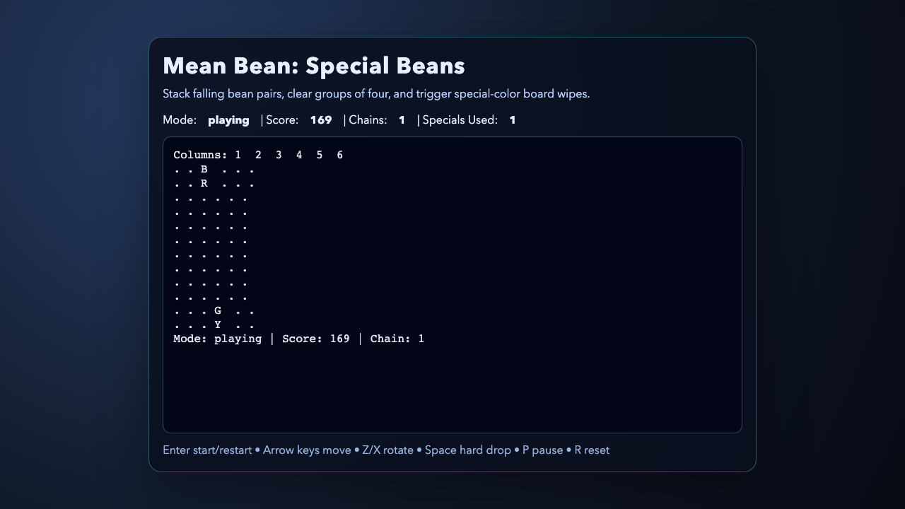
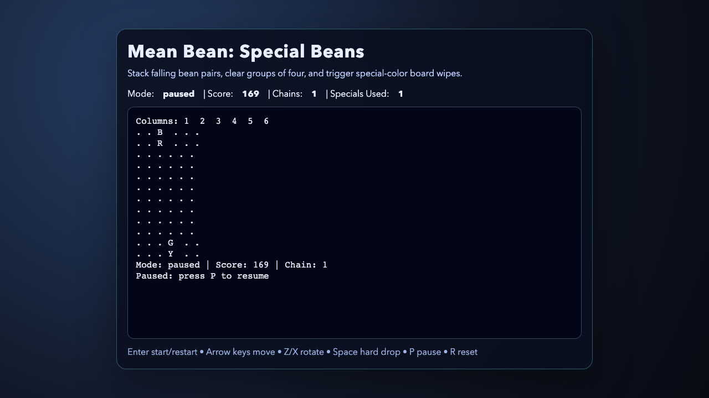

# daily-classic-game-2026-03-16-mean-bean-special-beans

<p align="center"><strong>Dr. Robotnik's Mean Bean Machine reimagined with deterministic special-bean board wipes.</strong></p>

<p align="center">Match falling bean pairs, chain clears, and trigger color-wide special beans for huge swings.</p>

<p align="center">
  
  
  
</p>

## GIF Captures
- `clip-title-to-start.gif`: Title screen to active drop loop.
- `clip-special-trigger.gif`: Special bean triggers color-wide wipe.
- `clip-pause-reset.gif`: Pause and reset controls in deterministic flow.

## Quick Start
```bash
pnpm install
pnpm test
pnpm build
pnpm capture
```

## How To Play
- Press `Enter` to start.
- Move pairs with `ArrowLeft`/`ArrowRight`, soft drop with `ArrowDown`.
- Rotate with `Z` (counter-clockwise) and `X` (clockwise), hard drop with `Space`.
- Pause with `P`, reset to title with `R`, restart from game over with `Enter`.

## Rules
- The field is a 6x12 board; each turn drops a two-bean piece.
- Groups of 4 or more connected same-color beans clear.
- After clears, gravity resolves and further chain clears award chain bonuses.
- If spawn is blocked, game ends.

## Scoring
- Base clear: `10` points per bean.
- Chain multiplier: `x1`, `x2`, `x3`... per consecutive cascade wave.
- Special-bean trigger bonus: `+100` when a special bean causes a color wipe.

## Twist
- **Special beans** appear in the deterministic piece queue.
- When a clear contains a special bean, all beans of that color clear across the board.

## Verification
- `pnpm test` validates deterministic core logic and special-bean scoring behavior.
- `pnpm capture` records deterministic Playwright artifacts and `render_game_to_text` snapshot.
- Browser hooks exposed:
  - `window.advanceTime(ms)`
  - `window.render_game_to_text()`

## Project Layout
- `src/` game loop, state model, renderer, browser hooks
- `tests/` node unit tests + Playwright capture scenario
- `artifacts/playwright/` screenshots, action payloads, and text snapshot
- `docs/plans/` implementation plan
